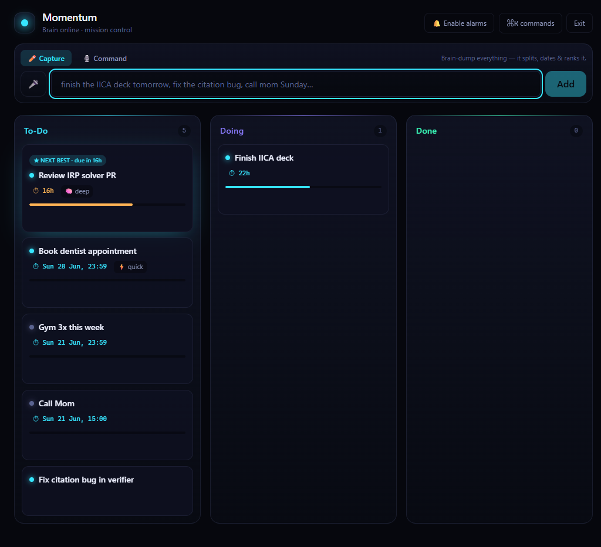

# Momentum

**An AI chief-of-staff that refuses to let things slip.**

Dump the chaos of your week into one box — typed or spoken. Momentum *understands* it: splits a brain-dump into real tasks, resolves "tomorrow evening" to a concrete time, infers priority and effort, ranks everything for you, and surfaces the **one thing to do next**. When a deadline nears and you've ignored it, it gets louder — a quiet push, then a full-screen alarm — and stops the instant you act.

🔗 **Live:** https://momentum-107722137045.asia-east1.run.app



## Why it's different

- **Intelligence is the product.** Natural-language capture, semantic voice control (no trigger words), auto-ranking with visible reasons ("ranked #1: due in 18h"), adaptive escalation. Not a CRUD board with a cron.
- **Cinematic.** A mission-control cockpit: deep-space dark, a drifting aurora, cards that lift under your cursor, a ⌘K command palette, and a Focus Mode that brings one card full-screen with a live countdown ring.
- **₹0, by construction.** Everything is serverless and scales to zero. Reminders are **event-driven Cloud Tasks** (one task at each deadline's exact time, deleted on completion) — **no background cron**, so when nothing is due and the app is closed, *nothing runs*. Held by enforced ceilings (`max-instances=1`, a Gemini key on a billing-disabled project that *cannot* bill, free-tier quotas), not by hope.
- **Secure by default.** Owner-locked, field-level AES-256-GCM encryption on task text, Argon2id auth behind a rate-limiter, OIDC-verified internal calls. Secrets live as GitHub Actions secrets and are injected as Cloud Run env vars at deploy (no paid Secret Manager).
- **CI/CD.** Push to `main` → GitHub Actions builds from source and deploys to Cloud Run automatically. CI typechecks + builds every push and PR.

## Speak, and the board obeys

> *"I'm doing the deck and the verifier PR."* → both cards move To-Do → Doing.
> *"finished the deck, starting the bug fix"* → one Done, one Doing, in a single breath.

Intent is inferred semantically — say it however it comes out. Ambiguous? It asks instead of guessing.

## Stack

Next.js 15 (App Router) · TypeScript · Tailwind v4 · Motion · dnd-kit · cmdk · Firestore (Admin SDK) · Gemini 2.5 Flash · Web Push (VAPID) · Cloud Run · Cloud Tasks (event-driven reminders) — deployed from source via Cloud Build.

## Run it

```bash
pnpm install
node scripts/gen-secrets.mjs        # writes .env + prints the owner passphrase
pnpm dev                            # http://localhost:3000
```

Deploy (Cloud Run, ₹0): `bash deploy.sh && bash setup-scheduler.sh`. Architecture and locked decisions: [`docs/dmj/specs`](docs/dmj/specs/2026-06-18-momentum-build-design.md) and [`idea.md`](idea.md).

---

Built by Divya Mohan with Claude Opus as co-architect. Aatmnirbhar Bharat — quality tools, built free.
