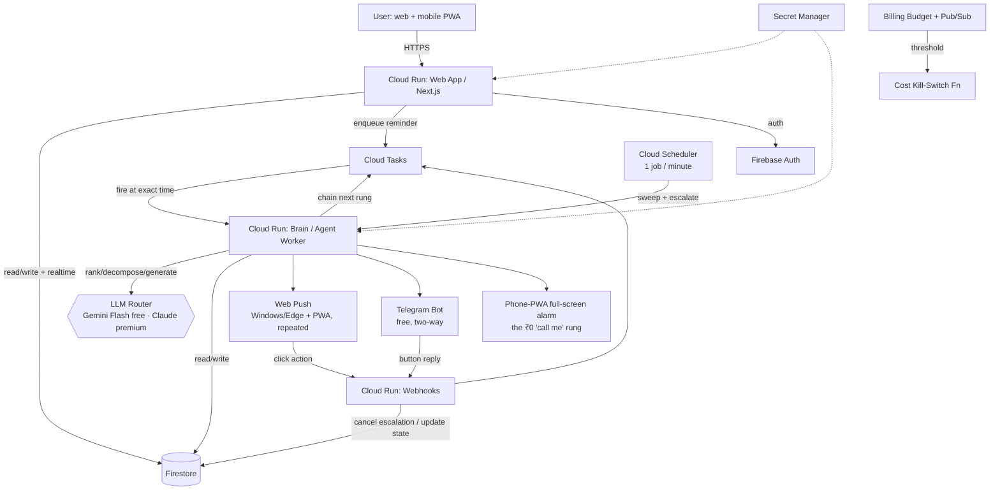

# MOMENTUM — an AI chief-of-staff that refuses to let things slip

> **Codename:** `momentum` · **Type:** Intelligent Kanban + adaptive multi-channel nudging engine
> **Author of brief:** Divya · **Brief date:** June 2026 · **Built by:** Claude Code
> **One line:** A cinematic, scale-to-zero task system that thinks about your work, ranks it for you, and escalates from a quiet push notification all the way to an AI phone call — only when it actually matters.
>
> *(Name is a placeholder — rename freely. Alternates: `Kairos`, `Cadence`, `Signal`, `Sentinel`.)*

---

## 0. How to read this file (note to Claude Code)

> ⚠️ **§16 (Review resolutions) is authoritative.** It records locked decisions from a 4-lens adversarial review (2026-06-18). Where §16 conflicts with anything in §1–§15, **§16 wins** — build from it for cost, security, data model, and escalation specifics.

This is a product + architecture brief, not a line-by-line implementation. You are expected to make engineering decisions, fill gaps, and **use your own tools to verify anything time-sensitive**. Specifically:

- **You may and should use `claude -p` (headless mode)** to: (a) re-verify current free-tier limits and pricing at build time and bake the numbers into `infra/cost-budget.json`, (b) research DLT-compliant SMS template wording for India, (c) generate boilerplate/IaC and then self-review it, (d) draft and audit Firestore security rules. Treat `claude -p "..."` as a research/codegen subroutine you can pipe into files.
- **Verify before you trust.** Cloud free tiers changed materially in 2025–2026 (see §14). The numbers in this doc were correct as of mid-June 2026 but *confirm them live* before provisioning.
- **The North Star constraints, in priority order:** (1) **₹0 when idle** — non-negotiable; (2) **genuinely intelligent**, not a CRUD board with cron; (3) **cinematic** UI; (4) **secure by default**; (5) **India-aware** for messaging/telephony.

---

## 1. The vision — what it should *feel* like

You dump the chaos of your week into one box — typed, pasted, or spoken: *"finish the IICA deck, fix the citation bug in the verifier, call mom Sunday, review the IRP solver PR, gym 3x."* The board doesn't just store it. It **understands** it: splits the deck into real subtasks, infers deadlines, tags effort and cognitive load, links the PR review to its blocker, and quietly slots everything into a Kanban it ranks *for* you.

When you open it, it's not a spreadsheet with extra steps. It's a **mission-control cockpit**: deep-space dark, volumetric glow, cards that lift and tilt under your cursor with real physics, an aurora shimmering behind the columns. A single keystroke (`⌘K`) drops you into **Focus Mode** — the rest of the world dims and one card fills the screen with a countdown ring: *the one thing to do next.*

And it has a spine. The closer a critical task gets to its deadline — and the longer you ignore it — the louder it gets, on a ladder it learned from *your* behavior: a silent push, then a Telegram ping, then WhatsApp, then an SMS, and finally **an actual phone call** where an AI voice reminds you and listens for your reply — *"done," "snooze an hour," "I'm blocked."* It stops the instant you act. It never nags about the trivial.

That's the product: **a system that carries the cognitive load of remembering, prioritizing, and chasing — so you only carry the doing.**

---

## 2. Core principles

| Principle | What it means concretely |
|---|---|
| **Scale-to-zero, ₹0 idle** | Every compute component runs serverless with `min-instances=0`. No always-on VMs, no idle databases. When nobody's using it, the bill is zero — enforced, not hoped. |
| **Intelligence is the product** | The differentiator is the brain (capture → decompose → rank → predict → escalate), not the board. If you removed the AI and it still felt useful, we under-built. |
| **Adaptive, not scheduled** | Nudges escalate based on *learned* response behavior per channel and time-of-day — not dumb fixed reminders. |
| **India-clean by default** | Free, instant, regulation-free channels (Telegram/WhatsApp) are primary. SMS/voice are an opt-in paid escalation tier, never a hard dependency. |
| **Secure by construction** | Zero-trust. Owner-scoped data, signed invocations, verified webhooks, secrets in a vault, a hard cost kill-switch. |
| **Open-source-ready** | Single-tenant personal tool that can become a public dmj.one project. Keep config/secrets cleanly separated; license TBD (MIT for adoption, AGPL to protect the commons). |

---

## 3. What makes it *intelligent* (the heart)

This is the section to over-deliver on. Build these as discrete, testable capabilities behind a model-agnostic `Brain` interface (§11).

1. **Natural-language capture & auto-structuring.** A single input accepts a brain-dump (text, paste, or voice → STT). The brain returns structured tasks: title, inferred due date/time, priority, project, tags, **effort estimate**, **cognitive load** (deep/shallow), and detected dependencies. Ambiguity is surfaced inline ("*'Sunday' → 22 Jun, correct?*"), never silently guessed for anything that triggers a paid action.
2. **Auto-decomposition.** Large tasks ("IICA deck") explode into ordered subtasks with their own estimates. The user can accept all, edit, or collapse back. Decomposition is *suggested*, never forced.
3. **Smart ranking ("what's next").** The board continuously re-ranks using a hybrid of (a) deterministic signals — deadline proximity, effort, blocked/blocking status, age-in-column — and (b) an LLM judgment pass over the top-N for nuance. Surfaces a single **Next Best Task** and a "today" lane. Eisenhower urgent/important is the mental model; expose the *why* ("ranked #1: due in 18h, blocks 2 others").
4. **Predictive, adaptive nudging.** The system logs every nudge, the channel, the time, and your response latency. It builds a lightweight per-user model: *which channel you actually act on, at which times.* Mornings you ignore Telegram but answer calls → it escalates faster before noon. This is the secret sauce — keep the model simple (rolling stats / a tiny logistic model is plenty; no GPU, no training infra).
5. **Stale-task reality checks.** Anything rotting in a column past a threshold gets an LLM triage nudge: *"'Verifier refactor' has sat in In-Progress 9 days. Split it, delegate it, or kill it?"* with one-tap actions.
6. **Dependency & critical-path awareness.** Detect blockers; warn when a downstream deadline is at risk because an upstream task is slipping. Visualize the chain.
7. **Energy/context routing (calendar-aware).** Pull free/busy from Google Calendar (free API). Suggest deep-work cards during focus blocks, quick wins for the 10-minute gaps between meetings.
8. **AI voice accountability calls.** For tasks flagged `critical`, the top escalation rung places a real call. An LLM generates a short, *context-aware* spoken nudge (not a robotic "you have a task"). The caller listens: speech or DTMF → "done / snooze / blocked" updates the board. Genuinely novel and genuinely cinematic.
9. **Weekly mission briefing.** Auto-generated recap + week-ahead plan, optionally delivered as a ~45-second narrated audio (TTS). *"Last week you shipped the credential verifier. The IICA deck is now your highest risk. Here's the plan."*

---

## 3A. Voice control — speak, and the board obeys

**Primary interface, not a stretch.** Divya drives the whole board by voice from the Windows/Edge PWA (and phone). Typing is the fallback.

**STT is free — no paid Cloud STT ever. Two input methods, one shared inference.**

Whatever you say goes through the *same* Gemini inference (§10); the only difference is how speech becomes input:

1. **Default — Win+H, then Gemini infers from the text.** You speak in Edge with **Win+H Voice Typing**; it types your words into the capture box; Gemini reads that *text* and derives everything (intent, which cards, deadlines). Win+H transcribes for free and instantly, so this path **spends zero Gemini audio quota** and has no round-trip lag. This is the everyday path — lean on it.
2. **One-click — the big mic button → Gemini audio end-to-end.** Press the single large mic; the browser records (MediaRecorder, works in Edge) and hands the *audio* straight to Gemini, which transcribes **and** infers internally — you do nothing else. Fully hands-free; costs a little Gemini audio quota; use it when you don't want to reach for Win+H.
3. **Fallback:** just type.

Both land in the identical command pipeline, so you can mix them freely. On Gemini quota exhaustion, Win+H + typing keep working (graceful, never a paid call). Web Speech / Vaani hidden-Chrome is no longer needed (Win+H and Gemini-audio both work in Edge); keep it only as an offline option.

### Three spoken verbs → column walk

Visible lanes collapse to the three the voice model drives; `blocked` is a side-flag (the §9 status enum `backlog|todo|in_progress|blocked|done` is unchanged internally):

```
speak  "I want to do X"    →  create card X in TO-DO       (status: todo)
speak  "I'm doing X"       →  move card X  TO-DO  → DOING   (status: in_progress)
speak  "I've finished X"   →  move card X  DOING  → DONE    (status: done) → auto-archive 24h
speak  "I'm blocked on X"  →  flag card X  blocked (stays put, marked)
```

- **No hard-coded trigger words — ever.** The brain infers intent from *whatever you actually say*; there is no vocabulary to memorize and nothing to forget. "kick it off", "I'll take the deck now", "deck's on me" all mean *doing* — decided by meaning, not a keyword list. The phrases shown above are **illustrations, not required syntax**: say it however it comes out, in any wording, and it still works. (Implementation: a semantic LLM classifier, never a string match.)
- **Reversible by voice** ("move it back", "reopen that") plus a 10s Undo on every action — speech misfires, so nothing is one-way.
- **Voice never traps you — the board is fully manual too.** Drag any card between columns (dnd-kit), inline-edit its title or deadline, reopen, archive, or delete by hand. Fix anything voice got wrong with a drag. Voice and pointer are co-equal; the board is the single source of truth.

### Many items in one breath
- *Capture many:* "finish the IICA deck, fix the citation bug, and call mom Sunday" → 3 To-Do cards, each parsed for its own deadline.
- *Transition many:* "I'm doing the deck and the verifier PR" → match 2 existing cards → both To-Do→Doing.
- *Mixed:* "finished the deck and starting the bug fix" → one Done + one Doing in a single utterance.

### Which card do you mean (the hard part)
Spoken "the deck" must resolve to the card "Finish the IICA deck."
- Match the spoken phrase → active (non-archived) cards by fuzzy + semantic similarity.
- **Confidence gate — extends the "never silently guess" rule to *transitions*, not just paid actions:**
  - single high-confidence match → act + toast ("✓ 'IICA deck' → Doing").
  - ≥2 close candidates or low confidence → **ask, don't guess** ("Did you mean *IICA deck* or *pitch deck*?").
  - no match on a transition verb → offer to create it instead.

### Fuzzy deadlines → concrete IST
The brain parses **any** time expression you use — "before evening", "by tomorrow afternoon", "after lunch", "end of the month", "in a couple hours" — resolving it to a concrete IST datetime, echoed back for confirmation ("'before evening' → today 18:00 IST ✓"). The rows below are just the **defaults for vague words**, not an exhaustive list and not keywords you must use:

| Spoken | IST |
|---|---|
| morning | 09:00 |
| noon / midday | 12:00 |
| afternoon | 15:00 |
| **evening** | **18:00** |
| night / tonight | 21:00 |
| end of day / EOD | 23:59 |

Relative dates ("Sunday", "tomorrow", "in 2 days") resolve against `now` in IST; anchors are user-configurable. A card **not in Doing or Done by its deadline** is what triggers the nudge ladder (§4). Working on it (Doing) counts as engaged and softens escalation; only `todo`/`blocked` past-deadline cards climb. *Say it; if I haven't started or finished it by when I said, chase me.*

---

## 4. The notification & escalation engine

The feature you explicitly asked for — *"remind me, and if I ignore it, get louder"* — built to run at **₹0**. Every channel in this build is free. SMS and real phone calls are **removed** (they cost money and need India DLT/telephony KYC); they survive only in §13 as paid-future options, off by default, never provisioned without your explicit cost acceptance.

### The escalation ladder
Each task has an **escalation policy** (default / important / critical). When a reminder fires and the task isn't acted on, the engine climbs the ladder, pausing at each rung for an *adaptive* interval (learned, see §3.4):

```
Rung 0  Web Push — Windows/Edge + installed PWA, REPEATED   (₹0)  PRIMARY · start & usual stop
Rung 1  Full-screen ALARM on the installed phone PWA —        (₹0)  best-effort "louder" rung:
        high-priority push, sound + vibrate, repeats until ack       NOT a guaranteed phone call
        (Telegram = deferred opt-in slot, §16.2 — not in the MVP ladder, by your choice)
```

> **Removed for ₹0:** SMS and AI voice call — both cost money + need India DLT/telephony KYC (see §13). **Reliability note (§16.2):** with no Telegram rung, the ladder is best-effort; a critical reminder can slip if Edge is closed and the phone alarm doesn't fire. Accepted tradeoff.

- **Engagement cancels escalation instantly.** Open the app, tap the push, reply "done" on any channel → the ladder halts and any pending escalation Cloud Tasks are deleted.
- **Climb speed is adaptive**, not fixed: the wait between rungs shrinks for channels/times where you historically respond, and for tasks nearing their deadline.
- **Quiet hours.** A user-set quiet-hours window suppresses lower-priority rungs; you can let the deadline-critical phone alarm pierce them (your choice, per task).

### How repeated push fires at ₹0 (your question — no always-on instance)

> **Concern:** sending a push at a future time looks like it needs a server that's always awake, and an always-on instance costs money.
> **Reality:** nothing stays awake. The pattern is *cron → scale-to-zero function → sleep*:
> 1. A **free serverless cron** fires the trigger — GCP **Cloud Scheduler** (3 jobs free) for the 1-minute sweep, or **Cloud Tasks** (1M ops/mo free) enqueued at the exact reminder time. On Cloudflare, a **Cron Trigger** (free).
> 2. The function **cold-starts** (Cloud Run `min-instances=0`, or a CF Worker), reads due/overdue reminders, sends the Web Push, enqueues the next repeat, and **returns to zero**. Awake time: a few hundred ms. `min=0` bills *only* while a request runs — **never for idle**. You are not paying for "one instance always on"; there is no always-on instance.
> 3. **Delivery is free and off your compute:** your function only hands the payload to the browser's push service (FCM for Chrome/Edge). That service delivers to the device while your function is already asleep.
> 4. **"Repeated" = the trigger fires again.** Each tick re-pushes any still-unacknowledged reminder until you act. No loop, no daemon, no held-open instance.
>
> Monthly math: ~43,200 one-minute ticks ≪ Cloud Run's 2M free requests; reminder reads in the hundreds ≪ Firestore's 50k/day free. **Idle ₹0, active ₹0 — inside always-free quotas.**
>
> **Honest caveat:** desktop Web Push only shows while Edge is running (Windows can wake Edge's push handler if background apps are enabled, but not if the machine is asleep/off). That is exactly why Rung 2 lives on your **phone** — the screen that's always with you.
> **Pure-zero-server option:** a service worker can self-schedule a notification with `showTrigger` / `TimestampTrigger` and *no server at all* — but it's experimental, Chromium-only, and unreliable for hard deadlines. Layer it on top of the cron path as an optimization, never as the backbone.

### Channel notes (all free)

- **Web Push (VAPID) — Rung 0, the primary.** Free native Windows/Edge notifications + the installed PWA, repeated per the mechanism above. Click/action buttons feed straight back to the board.
- **Phone-PWA alarm — Rung 1, $0.** A high-priority push opens a full-screen, ringing, vibrating alarm on your installed phone PWA that repeats until acknowledged. Best-effort (not a guaranteed phone call — see §16.2), but the loudest free rung.
- **Telegram Bot API — DEFERRED (not in MVP).** Designed-for but not built: two-way buttons, no DLT, no cost. A clean future opt-in if best-effort ever proves insufficient (§16.2).
- **Email (digests only).** Gmail SMTP or Resend free tier for the weekly briefing — not a real-time rung.

> **Cost discipline:** every rung above is ₹0 and within always-free quotas. **There are no billable channels in this build.** But a card is on file (Blaze), so *infra overage* (Cloud Run / Firestore / Gemini under a bug-loop or leaked credential) is a real spend vector. ₹0 is held by **enforced quota ceilings + a billing-unlink kill-switch (§16.1)**, not by the absence of paid channels — the earlier "structurally incapable of spending" framing was wrong.

---

## 5. System architecture

### Cloud strategy — the honest decision

- **Primary: Google Cloud.** Its always-free tier is **perpetual** (unlike AWS's new model) and maps perfectly to scale-to-zero: Cloud Run, Firestore, Cloud Tasks, Cloud Scheduler, Secret Manager, and a **free LLM** (Gemini Flash via AI Studio). Idle cost is structurally zero.
- **Fallback / always-on workhorse: Oracle Cloud (OCI).** Genuinely perpetual free ARM VM (post-15-Jun-2026: **2 OCPU / 12 GB RAM**, 200 GB storage, 10 TB/mo egress). Use *only* for anything that genuinely can't scale to zero (e.g., a self-hosted always-listening webhook relay or a private fallback bot). Not needed for MVP; keep it as an escape hatch.
- **AWS: deprioritized.** New accounts are now credit-based (~$200 / 6 months, then the Free-Plan account closes). Bad fit for "free forever." Use AWS *only* if Divya already holds a pre-July-2025 legacy account, and even then only for a specific always-free service (e.g., Lambda 1M req/mo). **Do not make AWS a dependency.**

### Components (all scale-to-zero unless noted)

| Component | Service (GCP) | Free-tier role |
|---|---|---|
| Web app (Kanban UI + Server Actions/API) | **Cloud Run** (`min-instances=0`) | 2M requests/mo free; cold-start acceptable for a personal tool |
| Brain / agent worker | **Cloud Run** (separate service, `min=0`) | Handles capture, ranking, nudge decisions, LLM calls |
| Database (tasks, policies, logs, models) | **Firestore (Native)** | Serverless, zero idle cost; realtime listeners for live board |
| Precise per-reminder firing | **Cloud Tasks** | Enqueue a callback at the exact reminder time → hits brain |
| Periodic safety-net sweep / escalation pass | **Cloud Scheduler** (1 job, every minute) | Catches missed reminders, drives escalation re-checks |
| Auth | **Firebase Auth** | Email/Google sign-in, generous free tier |
| Secrets | **Secret Manager** | API keys, bot tokens, provider creds |
| LLM (default) | **Gemini Flash via AI Studio** | Free daily quota — the default brain |
| LLM (premium) | **dropped** (see §13) | No paid LLM; free Gemini-or-deterministic brain only |
| File/asset storage | **none in MVP** | Cloud Storage left Spark in 2026; audio briefings dropped, briefings ship as text (§13) |

### Why Cloud Tasks + a thin Scheduler (the elegant scale-to-zero trick)

Polling-only would mean a cron that wakes constantly. Instead:
1. On task create/update, **enqueue a Cloud Task** to fire at the exact reminder time → calls the brain endpoint → sends the rung-0/1 nudge.
2. After dispatching a nudge, **enqueue a follow-up Cloud Task** at `T + adaptive_interval` that checks "did they engage?" If not, escalate one rung. This chains the whole ladder with zero idle compute.
3. A **single Cloud Scheduler job** (every minute) runs a cheap sweep as a safety net (catch clock skew, missed enqueues, stale-task triage). One job stays within free limits; ~43k invocations/month is trivially inside Cloud Run's 2M free requests.

Result: between events, **nothing runs**. The bill is zero.

### Architecture diagram



---

## 6. The ₹0 promise — cost model & guardrails

### Free-tier budget (verify live at build time — see §14)

| Resource | Free allowance (mid-2026) | Our expected usage | Headroom |
|---|---|---|---|
| Cloud Run requests | 2,000,000 / month | a few thousand (personal) | enormous |
| Firestore storage | 1 GiB | tens of MB | enormous |
| Firestore reads | 50,000 / day | hundreds | huge |
| Firestore writes | 20,000 / day | hundreds | huge |
| Cloud Tasks | ~1,000,000 ops / month | hundreds–thousands | huge |
| Cloud Scheduler | 3 jobs free | 1 job | fine |
| Gemini Flash (AI Studio) | ~1,000 requests / day (confirm) | tens–low hundreds | comfortable |
| Cloud Storage | 5 GB | < 1 GB | fine |
| Telegram / WhatsApp(svc) / Web Push | free | primary channels | n/a |
| **SMS + Voice** | **paid** | **critical, ignored tasks only** | **capped, see below** |

### Hard guarantees (build these, don't skip)

1. **Billing kill-switch — but it is the *secondary* guard (see §16.1).** Cloud Billing budgets are asynchronous (hours-to-days lag) and only *notify*, so the kill-switch Cloud Function must **unlink the billing account / disable services**, not flip a (now non-existent) paid-channel flag. The *primary*, synchronous guards are hard GCP quota caps + in-app atomic counters that 429 / hard-stop **before** spend. A runaway bill is bounded by those ceilings, not by monitoring.
2. **Daily LLM quota guard.** Track LLM calls/day in Firestore; when approaching the free Gemini limit, degrade gracefully (skip the "nuance" LLM ranking pass, keep deterministic ranking) instead of spilling into paid usage.
3. **Paid-channel monthly cap.** A counter on SMS/voice spend; once the cap is hit, escalation tops out at WhatsApp until the month rolls over. Default cap intentionally tiny.
4. **No NAT gateways, no load balancers, no premium networking, no multi-region.** These are the classic "free tier" bill-killers. Single region, direct Cloud Run URLs (or one free domain mapping).
5. **`infra/cost-budget.json`** is the single source of truth for every limit; `claude -p` should populate it from live docs at build time and the app should read it for its quota guards.

### Platform decision — GCP / Firebase (locked 18 Jun 2026)
**Chosen: GCP** — Cloud Run (`min-instances=0`) + Cloud Scheduler/Tasks + **Firestore** (kept for its realtime live board) + Firebase Auth + FCM Web Push. Divya accepts a **card on file** (Blaze billing) in exchange for keeping Firestore's realtime sync.
- **₹0 is held by construction, not trust:** `min=0` (no idle compute), everything inside always-free quotas (table above), **no paid channel wired in**, and the **billing-budget kill-switch** (guarantee #1) that disables spend on threshold breach. With a card now on file, that kill-switch is the single most important guard — **build and test it first, not in Phase 7.**
- **Worst case on record:** a card on file means non-zero theoretical exposure if a bug, quota breach, or credential leak runs up usage. Mitigation: `min=0` + free-quota headroom + a low budget alert + the kill-switch. The alternatives below stay card-free if that exposure ever feels wrong.
- **Alternatives recorded (clean migration paths — the app is stateless behind a DB abstraction):** **Cloudflare** (Workers + Pages + D1 + Cron) runs the whole system at ₹0 with *no card*; a **CF + Firebase Spark Firestore** hybrid keeps realtime card-free.
- Verified June 2026: Firebase Spark = no card but no server compute (can't self-send scheduled push); Cloudflare = no card with cron + compute; GCP = needs Blaze/card to open the account.
- **Target GCP project:** `dmjone` already exists (Divya's). Reuse it, or stand up a dedicated `momentum` project on the same billing account for blast-radius isolation + its own budget alert (recommended — a runaway in one app then can't touch the other). Confirm the exact **project ID** (not just the display name) at deploy, and set the budget kill-switch on whichever project hosts it.

---

## 7. Tech stack (modern, 2026, justified)

**Language:** TypeScript end-to-end (one language across web, brain, IaC) on the **Bun** runtime where it helps cold starts.

- **Web / full-stack:** **Next.js (App Router, React Server Components, Server Actions)** — the safe, dominant 2026 choice with first-class Cloud Run deploys; Server Actions keep secrets server-side. *(If you want a lighter, more motion-forward build, SvelteKit is a reasonable swap — your call.)*
- **Brain / API / webhooks service:** **Hono** — ultralight, edge/runtime-agnostic, sub-14KB, fast cold starts (ideal for scale-to-zero on Cloud Run/Bun), built-in JWT/CORS/Zod middleware. Keep it a separate Cloud Run service from the web app.
- **UI system:** **Tailwind CSS + shadcn/ui** for the component base, **Motion** (formerly Framer Motion) for physics-based animation, **dnd-kit** for accessible drag-and-drop, **React Three Fiber / a WebGL shader** for the cinematic aurora/particle background, **cmdk** for the ⌘K command palette.
- **State / data:** Firestore SDK with realtime listeners; **TanStack Query** for server-state caching; **Zod** schemas shared between web and brain.
- **AI orchestration:** **Vercel AI SDK** (provider-agnostic) behind a thin `Brain` interface so Gemini/Claude/local are swappable. Structured outputs via Zod-validated JSON (instruct models to return JSON only).
- **Auth:** Firebase Auth (web SDK + Admin SDK on the server).
- **IaC:** **Terraform** (or Pulumi if you prefer TS) — all GCP resources reproducible, with `min-instances=0` baked in.
- **Monorepo:** Turborepo or Bun workspaces — `apps/web`, `apps/brain`, `packages/shared`, `infra/`.
- **CI/CD:** GitHub Actions → build container → deploy to Cloud Run. Free.
- **PWA:** installable on mobile, offline-capable board, Web Push — so it feels like a native app without app-store cost.

---

## 8. Cinematic design system

**Direction: "Mission Control."** A film's HUD, not a productivity dashboard. Restrained, premium, alive.

- **Palette:** deep-space near-black base (`#0A0B0F`-ish), layered with subtle blue/violet nebula gradients, a single electric signature accent (pick one — cyan, amber, or magenta) used sparingly for priority/action. Glassmorphism panels with fine grain overlay to kill banding.
- **Depth & light:** volumetric glow behind active elements, soft long shadows, parallax layers, a slow-drifting **WebGL aurora/particle field** behind the columns (GPU-cheap; pause when tab hidden to respect battery + the ₹0 ethos).
- **Motion (the "cinematic" payload):**
  - Cards **lift, tilt, and cast depth shadow** on hover/drag (spring physics, not linear tweens).
  - Column transitions stagger; new tasks **materialize** (scale + glow-in) rather than pop.
  - **Focus Mode:** a "warp" transition dims the board and brings one card full-screen with an animated **countdown ring** and ambient (optional, muted-by-default) soundscape.
  - **Pressure gauge:** each critical card shows a live gauge of how close it is to triggering the next escalation rung — tension you can *see*.
  - Tasteful haptics on mobile; optional, subtle sound design on key actions.
- **Power-user surface:** ⌘K command palette for everything (create, search, jump, snooze, "what's next"), full keyboard nav, vim-ish shortcuts. Built for someone who lives on the keyboard.
- **Agent activity feed:** a live, ticker-style log of the brain's reasoning — *"Re-ranked: 'IICA deck' → #1 (due 18h, blocks 2). Scheduled Telegram nudge for 14:30."* Makes the intelligence visible and trustworthy.
- **Accessibility is not optional:** honor `prefers-reduced-motion` (drop to clean fades), WCAG AA contrast for all text, full screen-reader labels on the board and DnD, keyboard parity for every pointer action. Cinematic *and* usable.

> Use the `frontend-design` skill for token/structure discipline. Cinematic ≠ cluttered — the drama comes from depth, motion, and restraint, not from filling space.

---

## 9. Data model (Firestore, owner-scoped)

Sketch — refine as needed. All collections are scoped under the owner's UID; security rules enforce `request.auth.uid == ownerId` (§10).

```
users/{uid}
  profile, timezone (IST), quietHours, channels{telegram,whatsapp,sms,voice}, paidCapMonthly, paidSpendThisMonth

users/{uid}/tasks/{taskId}
  title, description, status(backlog|todo|in_progress|blocked|done),
  priority, dueAt, effortMins, cognitiveLoad(deep|shallow),
  projectId, tags[], dependsOn[], blocks[],
  escalationPolicy(default|important|critical), allowPaidEscalation:bool,
  rankScore, rankReason, createdAt, updatedAt, completedAt, ageInColumnDays(derived)

users/{uid}/reminders/{reminderId}
  taskId, fireAt, currentRung, status(pending|sent|acknowledged|escalated|cancelled),
  cloudTaskName (for cancellation), nextCheckAt

users/{uid}/nudgeEvents/{eventId}        # the adaptive-model training data
  taskId, channel, sentAt, respondedAt, responseLatencyMs, action(done|snooze|blocked|ignored), hourOfDay

users/{uid}/responseModel/{singleton}    # tiny learned stats per channel × time bucket
  perChannel{ telegram:{p_respond, medianLatency}, ... }, perHourBucket{...}

users/{uid}/projects/{projectId}
users/{uid}/briefings/{weekId}           # weekly recap + audio URL
```

Index the obvious query paths (status, dueAt, rankScore). Use a TTL policy to auto-expire old `nudgeEvents` if storage ever matters (note: Firestore TTL/managed-deletes require billing enabled — fine on Blaze, still within free quota).

---

## 10. The AI brain — model strategy & contracts

**Model router (`packages/shared/brain`)** with three tiers behind one interface:

1. **Default & only runtime brain — Gemini Flash (free):** all routine work — voice-command parsing, capture, decomposition, ranking nuance, nudge copy. Stays in the free daily quota; as the quota nears, **degrade to deterministic logic** (keyword/fuzzy intent + rule-based ranking) rather than spend a paisa.
2. **Premium — Claude API (paid): NOT wired in this ₹0 build.** Listed in §13 as a future opt-in; off, uncalled, and incapable of billing until you explicitly enable it.
3. **Build-time — `claude -p` (Claude Code headless):** not a runtime dependency — used *during the build* to verify live free-tier limits, scaffold code, and audit security rules.

**Contracts (keep them strict):**
- Every brain call returns **Zod-validated JSON only** (system prompt: "Return only JSON, no prose, no markdown fences"). Parse defensively; on parse failure, fall back to deterministic behavior, never crash.
- **Capture:** input free text → `Task[]` with confidence flags on inferred dates/priorities.
- **Voice command (audio *or* text):** input a recorded clip *or* a transcript → `{ transcript, commands: Command[] }`, where each `Command` is `{ verb: want|doing|done|blocked|query, cardRef?, newTask?, deadlineIST?, confidence }`. Gemini Flash does STT + parse in a single multimodal call. Intent is inferred **purely semantically — no keyword tables, no required phrases**; any wording maps to the right verb. Low confidence or an ambiguous `cardRef` ⇒ **ask, never guess** (§3A). Cap clips at ~60s.
- **Rank:** input top-N tasks + context (now, calendar free/busy) → ordered list with one-line `rankReason` each.
- **Nudge copy:** input task + rung + user tone → a short, human, context-aware message (and for voice, a ~2-sentence spoken script).
- **Decompose:** input one task → ordered `Subtask[]` with effort estimates.
- **The adaptive nudge decision is *not* an LLM call** — it's cheap deterministic logic over `responseModel` stats. Keep the LLM out of the hot path for cost and latency.

---

## 11. Security & privacy (build to Divya's bar)

- **Zero-trust data access.** Firestore security rules lock every document to its owner UID. No client ever reads another user's data. Server (Admin SDK) operations use a least-privilege service account.
- **Verify every inbound webhook.** Telegram secret-token header, Web Push subscription/auth checks, Cloud Tasks/Scheduler OIDC token verification. Reject anything unsigned. Webhook endpoints are the soft underbelly — treat them as hostile.
- **Signed internal invocations.** Cloud Scheduler → brain and Cloud Tasks → brain use OIDC service-account auth; the brain rejects unauthenticated calls. No public unauthenticated mutation endpoints.
- **Secrets only in Secret Manager.** Bot tokens, provider creds, API keys — never in client bundles, never in the repo. Inject at runtime. Enable Firebase **App Check** to block abuse of client APIs.
- **PII minimization.** The free ladder needs no phone number — store only the Telegram chat ID + Web Push subscription, encrypted-at-rest. Don't log message bodies with PII; redact in logs.
- **Rate limiting + abuse guards** on capture and webhook endpoints (Hono middleware).
- **The cost kill-switch is also a security control** — with a card on file (Blaze), it caps blast radius if credentials leak and someone tries to burn your GCP quota. Treat it as a primary control, not an afterthought.
- **Supply chain:** pin dependencies, enable Dependabot, run `npm audit`/`bun audit` in CI. Have `claude -p` review the generated Firestore rules and webhook validators specifically.

---

## 12. Build plan for Claude Code (phased, with acceptance criteria)

Work in phases; each ends in something runnable. Use `claude -p` for research/codegen subtasks as noted.

**Phase 0 — Recon & scaffolding**
- `claude -p` to verify current GCP/OCI free-tier numbers and Gemini free quota; write `infra/cost-budget.json`.
- Monorepo scaffold (Bun workspaces / Turborepo), `apps/web` (Next.js), `apps/brain` (Hono), `packages/shared` (Zod schemas, Brain interface), `infra/` (Terraform).
- ✅ *Done when:* both apps boot locally; shared types import cleanly; Terraform plans without error.

**Phase 1 — Core Kanban + data**
- Firestore data model + security rules; Firebase Auth; CRUD board with drag-and-drop (dnd-kit) and realtime listeners.
- ✅ *Done when:* you can sign in, create/move/complete tasks, and see updates live across two tabs; rules deny cross-user access (test it).

**Phase 2 — The brain (capture, decompose, rank)**
- Model router (Gemini Flash default), Zod-validated contracts, natural-language capture, auto-decomposition, hybrid ranking + Next Best Task, daily LLM quota guard.
- ✅ *Done when:* a brain-dump produces structured tasks; the board ranks itself with visible reasons; quota guard degrades gracefully when forced.

**Phase 3 — Reminders & the escalation ladder**
- Cloud Tasks precise firing + chained escalation; 1 Cloud Scheduler sweep; Web Push (rung 0); **Telegram bot** (rung 1) with reply buttons → webhook → cancel escalation.
- ✅ *Done when:* a task with a near due-time pushes, then escalates to Telegram if ignored, and *stops the instant you tap "Done"* — with stale escalation tasks deleted.

**Phase 4 — Rung 2: the free "call me" alarm**
- Phone-PWA full-screen alarm: a high-priority push opens a ringing, vibrating, full-screen takeover on the installed phone PWA that repeats until acknowledged; the Done / Snooze / Blocked actions feed the board. All ₹0.
- ✅ *Done when:* a `critical`, ignored task escalates web push → Telegram → a phone alarm that won't stop until you act, and halts instantly when you do. (Paid SMS/voice rungs are explicitly **out of scope** — see §13.)

**Phase 5 — Adaptive intelligence**
- Log `nudgeEvents`; compute `responseModel`; make climb-speed adaptive by channel × time; stale-task triage; calendar-aware energy routing; weekly briefing (+ optional TTS audio).
- ✅ *Done when:* escalation timing visibly differs by time-of-day based on logged behavior; a weekly briefing generates.

**Phase 6 — Cinematic polish**
- Mission-Control theme, physics drag, aurora/WebGL background, Focus Mode warp + countdown ring, pressure gauges, ⌘K palette, agent activity feed, haptics, `prefers-reduced-motion` + a11y pass.
- ✅ *Done when:* it looks like the §1 vision, and it's fully usable with reduced motion + keyboard + screen reader.

**Phase 7 — Ship to ₹0**
- Terraform apply (single region, `min=0` everywhere), GitHub Actions deploy, App Check, budget kill-switch live, secrets in Secret Manager.
- ✅ *Done when:* it's live on Cloud Run, idle cost is provably ₹0 (check billing after a quiet day), and a synthetic "leak" can't breach the cap.

---

## 13. Stretch / future (don't build now, design so they're possible)

### Dropped from the ₹0 build (costs money — revive only if you ever accept the charge)
- **SMS escalation** — needs a paid India provider (MSG91 / Gupshup) + DLT registration (PAN/KYC, template approval). The *only* thing it buys over the free ladder: reach with no internet/data. Wire it (off by default, capped) only if that offline gap ever actually bites.
- **Real AI voice call** — needs a paid India telephony provider (Exotel / Plivo, **not** Twilio) + KYC. Replaced in this build by the free phone-PWA alarm (Rung 2), which gets ~90% of a call's un-ignorability for ₹0.
- **WhatsApp Cloud API** — free service tier, but needs Meta Business verification; dropped to keep onboarding zero-friction. Telegram covers the rich free channel.
- **Premium Claude API brain** — paid; the free Gemini-Flash-or-deterministic brain (§10) carries the whole build.
- **Cloud Storage / audio briefings (TTS)** — Cloud Storage left the Firebase free (Spark) plan in 2026 and now needs a card; weekly briefings ship as **text**, no audio, until that changes.

### Genuinely future (not dropped, just later)
- "Negotiation" mode: when overloaded, the brain proposes what to drop/defer and asks you to approve a realistic day.
- Shareable accountability: a trusted contact gets pinged if a critical task is missed (opt-in).
- Multi-user / team boards (would change the cost math — revisit free-tier headroom).
- Local-LLM fallback on the OCI ARM box (Ollama, 7B-class) for fully-private inference when offline from cloud LLMs.
- Open-source release on dmj.one with a one-command deploy.

> **Promoted to core:** voice-first control is no longer a stretch — it is *the* primary interface (§3A).

---

## 14. Sources to re-verify at build time (facts were current mid-June 2026)

These changed recently and *will* change again — confirm live (`claude -p` + web), don't trust this table blindly:

- **AWS free tier (new model):** new accounts since 15 Jul 2025 get credit-based Free Plan (~$100 + ~$100 earnable, ~$200 total), expiring after 6 months / on credit depletion, account closed after a 90-day grace; 30+ always-free services persist; pre-15-Jul-2025 accounts keep the legacy 12-month model. → *AWS unsuitable as the perpetual-free primary.*
  - aws.amazon.com/about-aws/whats-new/2025/07/aws-free-tier-credits-month-free-plan/
  - docs.aws.amazon.com/awsaccountbilling/latest/aboutv2/free-tier.html
- **GCP always-free (perpetual):** Cloud Run 2M req/mo; Firestore 1 GiB + 50k reads/day + 20k writes/day + 10 GiB egress/mo; Cloud Storage 5 GB; e2-micro VM; from 3 Feb 2026 projects need Blaze (PAYG) billing for default buckets but always-free quotas still apply.
  - firebase.google.com/docs/firestore/quotas · cloud.google.com (Cloud Run, free-tier pages)
- **Gemini free tier (AI Studio):** ~1,000 Flash requests/day reported — confirm exact current model + limit, it shifts.
- **OCI always-free (perpetual, reduced 15 Jun 2026):** Ampere A1 now **2 OCPU / 12 GB RAM** total (1,500 OCPU-hrs + 9,000 GB-hrs/mo), 2 AMD micro (1/8 OCPU, 1 GB each), 200 GB block storage, 10 TB/mo egress.
  - docs.oracle.com/iaas/Content/FreeTier/freetier.htm
- **India SMS / DLT** *(only relevant if you ever revive paid SMS — dropped from the ₹0 build, §13):* TRAI TCCCPR/DLT mandatory for local routes + sender IDs; commercial SMS only 0900–2100 IST; templates pre-approved. Use an India-native provider (MSG91/Gupshup), **not** Twilio.
  - support.twilio.com (India SMS limitations) · TRAI TCCCPR 2018

---

## 15. First command to give Claude Code

> *"Read `MOMENTUM_IDEA.md`. Start with Phase 0: use `claude -p` to verify the current GCP, OCI, and Gemini free-tier limits against live docs and write `infra/cost-budget.json`, then scaffold the Bun monorepo (Next.js web + Hono brain + shared Zod package + Terraform infra) per §7 and §12. Show me the plan and the cost-budget file before provisioning anything."*

---

*Built to be cinematic, intelligent, and — via the enforced quota ceilings in §16 — structurally bounded from surprising you with a bill. Now go make it real.*

---

## 16. Review resolutions — locked decisions (authoritative; supersede §1–§15)

*From a 4-lens adversarial review (pre-mortem · YAGNI · ambiguity · security) on 2026-06-18. Binding. Build from here.*

### 16.1 Cost — ₹0 is enforced by ceilings, not hope (highest priority)
A card is on file (Blaze); the real spend vector is **infra overage** (Cloud Run / Firestore / Gemini) under a bug-loop or leaked credential — not paid channels (there are none). Bound it with synchronous, pre-spend controls, built in **Phase 0/1, not Phase 7**:
- **Dedicated GCP project `momentum`** — NOT the shared `dmjone` (a shared budget trips on either app's spend and would kill both).
- **Hard GCP quota overrides** so overruns 429 instantly: Generative Language API requests/day near the free ceiling; Cloud Tasks dispatch capped; Cloud Run **`max-instances` = 1–2** on every service.
- **In-app atomic Firestore counters** (transactional) checked **before** each Gemini/Cloud-Task call; hard-stop at a fraction of free quota. Counter is the gate; quota override is the backstop.
- **Kill-switch = unlink billing / disable services** (Budget→Pub/Sub→Fn), treated as **secondary** (budgets lag hours–days, only notify).
- **Cloudflare in front of Cloud Run** (free, your standard) so anonymous floods reject at the edge and never cold-start a billed container. No public direct Cloud Run URLs.
- **Owner-UID allowlist** (16.5) so open signup can't farm the card.

### 16.2 Reliability — DECIDED: web push + phone alarm only (no Telegram)
Web push alone is unreliable: desktop push shows only while Edge is awake; the phone-PWA alarm is **best-effort** (good on Android Chrome with the PWA installed + notifications allowed, weaker on iOS).
- **DECIDED (tradeoff on record):** default ladder = **web push (repeated) → full-screen phone-PWA alarm**, **no Telegram**. Accepted consequence: a `critical` reminder *can* be missed if Edge is closed/asleep and the phone alarm doesn't fire. There is **no guaranteed channel** in this configuration — by the user's explicit choice for simplicity.
- **Maximise best-effort reliability anyway:** prompt to install the PWA on the phone at onboarding; high-priority FCM data messages; repeat with sound + vibration until acked; fire `critical` slightly early; surface a persistent in-app "N reminders unacknowledged" banner so nothing silently rots.
- **No task is markable `critical`** until the phone PWA is installed and a canary test-notification has been acked (verifies its one best-effort channel actually works).
- **Escape hatch (deferred, not built):** the ladder + schema leave a clean slot for Telegram as a future one-switch opt-in rung; if best-effort ever drops something important, it's a small add, not a rebuild.

### 16.3 Escalation mechanics (carry verbatim into build)
- **First reminder fires AT `dueAt`** (rung 0); pre-deadline "pressure" is UI-only (gauge), never a push. No `dueAt` ⇒ never enters the ladder. So `reminders.fireAt = task.dueAt` at creation.
- **Repeat = chained Cloud Tasks**; Cloud Scheduler is ONLY the 1-min safety-net sweep, never the re-pusher (no double-sends). Rung-0 repeat every 10 min, **max 3**, then climb a rung; each repeat re-enqueues one Cloud Task.
- **One-outstanding-Cloud-Task invariant:** exactly one pending task per reminder (strict sequential chaining); `cloudTaskName` stays singular; ack/cancel deletes it. Firestore (`acknowledgedAt`) is the source of truth; every firing self-suppresses if acked; the sweep reconciles missed/stuck reminders.
- **Ack vs pause:** explicit "done" on any channel OR card→Done = **cancel** (delete pending task, `status=acknowledged`). Card→Doing = **pause** (halt climb; re-arm if it leaves Doing). A bare app-open / push-click with no state change does NOT cancel — it only resets the rung-0 repeat counter.
- **Snooze:** `fireAt = now + 1h` (default), `currentRung = 0`, delete pending + enqueue fresh rung-0; does NOT alter `dueAt` (lateness still tracked).
- **Quiet hours:** `critical` pierces them **by default** (opt-out); fire `critical` slightly early to beat 1-min granularity + cold-start lag.

### 16.4 Data model fixes
- **`blocked` is its own boolean `isBlocked` (+ `blockedReason`), NOT a status.** `status = backlog | todo | in_progress | done`. Climb-eligible = `status ∈ {backlog, todo}` regardless of `isBlocked` (a blocked in_progress card is engaged → does not climb).
- **Status → column map (exact):** `backlog → To-Do` (unranked inbox sub-zone, excluded from Next-Best); `todo → To-Do` (ranked); `in_progress → Doing`; `done → Done`; `isBlocked=true → stays in its column with a blocked badge`. Voice "I want to do X" creates `status=todo` (ranked), never `backlog` (backlog is reached only by manual demotion).
- **`archivedAt` ≠ `deletedAt`:** archive is reversible + queryable — `archivedAt = completedAt + 24h` (set by the sweep); archived cards leave the board but stay searchable (⌘K); "reopen" clears `archivedAt`, sets `status=in_progress`. Soft-delete (`deletedAt`) is separate and replaces hard-delete everywhere.
- **`escalationPolicy` (`default|important|critical`) assignment:** brain infers it at capture from urgency/`dueAt`, user-overridable; default = `default`. (Without an assignment rule, nothing ever reaches the critical rung.)

### 16.5 Security must-haves (align with your bar)
- **Owner lock — the only gate (per user):** mandatory **Firebase Authentication with Google sign-in** (Google Cloud service); allow exactly one identity, `OWNER_EMAIL` (env; = Divya's Google account, `divyamohan1993@gmail.com`), checked in BOTH Firestore rules and server code as `request.auth.token.email == OWNER_EMAIL && request.auth.token.email_verified == true`. Every other account is denied everything; no anonymous access, no open sign-up. This single email gate is the entire access-control model — nothing else added.
- **Admin SDK bypasses rules:** the server re-derives `ownerId` from the verified caller, NEVER from request body; brain/webhooks run under a dedicated least-privilege service account; App Check on the capture endpoint (not as authz).
- **Gemini key never in client:** all Gemini calls go through the server (audio uploaded to the brain; brain calls Gemini with a Secret-Manager key). CI secret-scan; no `*_API_KEY` / private VAPID in any client bundle.
- **Webhooks:** pin OIDC `aud` + exact SA email (Cloud Tasks/Scheduler); Telegram secret-token constant-time compare + `update_id` idempotency + timestamp window; push click-action callback authenticated with a signed, single-use token tied to `reminderId+uid`. No unauthenticated public mutation path.
- **Prompt injection:** the LLM only *proposes* a structured `Command`; a deterministic layer validates `verb ∈ enum`, resolves `cardRef` server-side against the owner's own cards, and **destructive/bulk actions require explicit confirmation regardless of confidence**; model copy is escaped; the model never chooses recipient/channel.
- **Backup + audit:** Firestore PITR or a daily export to a (Blaze-free) GCS bucket; append-only `auditLog` (auth, webhook-verify outcome, escalation sends, spend-affecting actions), owner-readable / client-write denied; structured logs with a redaction allowlist (never log task bodies, chatId, tokens).
- **DECIDED (bar vs MVP) — core security now, heavy items fast-follow:** ship all of the above (owner lock, server-side authz, webhook verification, Cloudflare edge, Secret Manager, append-only audit, soft-delete) in the MVP. **Deferred as a deliberate, time-boxed deviation from the global bar:** field-level quantum-safe crypto (AES-256-GCM, ML-KEM/ML-DSA, Argon2id) on PII fields, and the full `/super-admin` panel. *Deviation recorded here, not silent.* Until then: Firestore at-rest encryption + owner-lock + rules are the data boundary; revisit before any multi-user or public-data expansion.

### 16.6 Scope — MVP spine vs deferred (UI kept per your mandate)
- **KEEP (non-negotiable):** the cinematic "mission-control" UI, built cost-cheap — CSS/Motion core, WebGL aurora lazy-loaded + behind `prefers-reduced-motion`. It is the portfolio USP; not cut.
- **KEEP slim:** voice = **Win+H → text → Gemini** as the v1 path (zero audio quota); the one-click **big-mic → Gemini-audio** button is a Phase-2 fast-follow. The semantic intent classifier is CORE (no keyword tables — never cut). **Single Next.js app** (Server Actions + route handlers), not a two-service split. Gemini called directly behind one thin function (no multi-LLM router). Deterministic fallback applies to **ranking only** — intent stays semantic; if Gemini is down, voice-intent is unavailable → fall back to manual/typing, never keyword-guessing.
- **DEFER (no mandate, YAGNI):** adaptive per-channel/time ML model (use fixed intervals — default 30m / important 10m / critical 3m), auto-decomposition, hybrid-LLM nuance ranking + Eisenhower, calendar/energy routing, weekly narrated briefings, stale-task LLM triage, dependency/critical-path graph.

### 16.7 Phase-order correction
**Phase 1 = a thin end-to-end shippable spine:** board (manual + realtime) + voice capture (Win+H→text→Gemini, semantic, ask-don't-guess) + ONE reminder that fires at `dueAt` and cancels on ack — all at ₹0 with the cost guardrails (16.1) live from day one. Then layer the rungs, then polish, then the deferred intelligence.